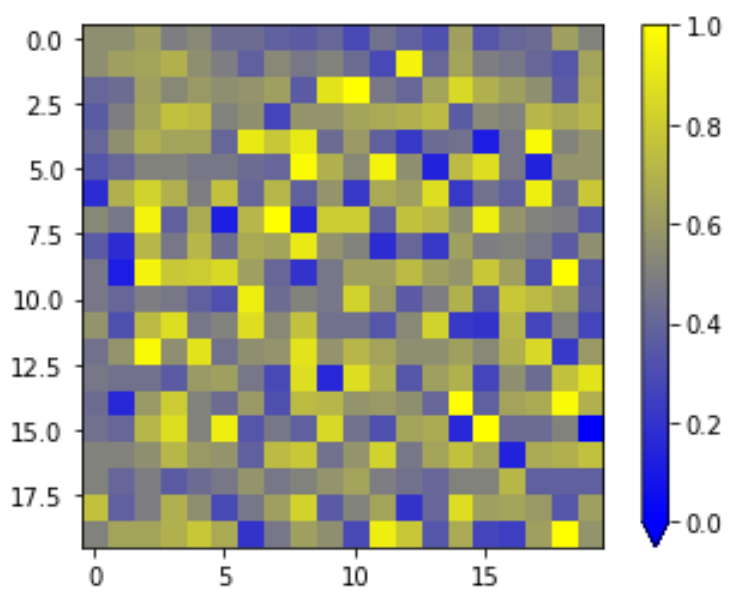

# Simple Perceptron

I recently came across a description of a simple perceptron (https://www.youtube.com/watch?v=GVsUOuSjvcg) and decided to implement it as a means of understanding the fundamentals of neural networks. I utilized the video linked above and the wikipedia page @ https://en.wikipedia.org/wiki/Perceptron to develop a model that could classify images as circles/rectangles. 

## Usage
The Jupyter notebook provided lists all the functions for training, testing, and visualizing the data. Additionally, a pickled weights file is provided with the final trained model and a records.txt file containing combinations of Bias, Iterations, and Epochs that resulted in strong accuracies. 

## Results
The final model achieved an accuracy of 60.667% which is relatively better than randomly guessing at the images and decently strong for a single perceptron. With additional tuning and better loss/learning rate functions, this accuracy could be improved upon. 

An example of the final model and its weights is shown below. 

